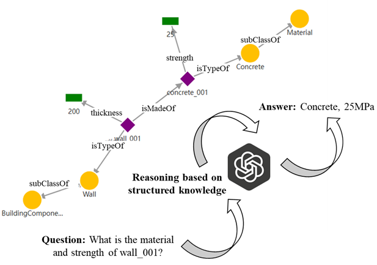
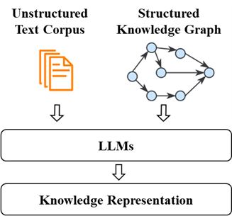

In this trial, you are expected to explore knowledge about offsite construction and specific inter-module connection design options by using a knowledge system based on large language models (LLMs). You will be given general introduction and step-by-step guidance for the software trial followed by a quick questionnaire for your valuable feedback.

OSC is deemed as a promising approach to enhance productivity, affordability, and sustainability in the construction sector by adopting a product-centric, lifecycle-integrated and manufacturing-style model [1]. Despite these advantages, the widespread adoption of OSC remains limited, largely due to fragmented and unstructured knowledge that hinders sharing and reuse, which limits skill transfer, impedes decision-making, and undermines scalability [2]. For example, much of the available knowledge is embedded in project documents, design files, and experiential know-how. This makes it challenging to interpret, share, and integrate knowledge in ways that are accessible to both human practitioners and intelligent systems.

Recent advances in LLMs offers new opportunities for intelligent knowledge retrieval [3]. However, existing LLMs cannot adequately support reasoning across heterogeneous, evolving and dynamic project contexts [4]. This gap can be addressed by combining structured knowledge graphs (KGs) with LLMs to enable context-aware knowledge reasoning. For example, as shown in **Figure 1**, KGs offer a means to represent entities and relationships explicitly, enabling improved reasoning over unstructured textual data [5].

**Figure 1.** LLMs for reasoning on structured knowledge

To comprehensively utilise all knowledge within unstructured text corpus and structure KGs, this system combines both with LLMs to answer questions (see **Figure 2**). Users can flexibly retrieve them for getting general or specific knowledge in different scenarios. You will have chance to try different modes for getting enhanced and accurate response from LLMs, for example, using unstructured knowledge retrieved from documents for general questions or using structured knowledge retrieved from KGs for specific design cases.

**Figure 2.** Unified knowledge representation

## Reference

[1]	Z. Zhang, Y. Zou, B.H.W. Guo, J. Dimyadi, R. Davies, L. Jiang, Knowledge management for off-site construction, Autom. Constr. 166 (2024) 105632. https://doi.org/10.1016/j.autcon.2024.105632.

[2]	X. Gan, R. Chang, J. Zuo, T. Wen, G. Zillante, Barriers to the transition towards off-site construction in China: An Interpretive structural modeling approach, J. Clean. Prod. 197 (2018) 8–18. https://doi.org/10.1016/j.jclepro.2018.06.184.

[3]	Y. Wan, Z. Chen, Y. Liu, C. Chen, M. Packianather, Empowering LLMs by hybrid retrieval-augmented generation for domain-centric Q&A in smart manufacturing, Adv. Eng. Inform. 65 (2025) 103212. https://doi.org/10.1016/j.aei.2025.103212.

[4]	L. Zhang, A. Lobov, Semantic Web Rule Language-based approach for implementing Knowledge-Based Engineering systems, Adv. Eng. Inform. 62 (2024) 102587. https://doi.org/10.1016/j.aei.2024.102587.

[5]	S. Pan, L. Luo, Y. Wang, C. Chen, J. Wang, X. Wu, Unifying Large Language Models and Knowledge Graphs: A Roadmap, IEEE Trans. Knowl. Data Eng. 36 (2024) 3580–3599. https://doi.org/10.1109/TKDE.2024.3352100.